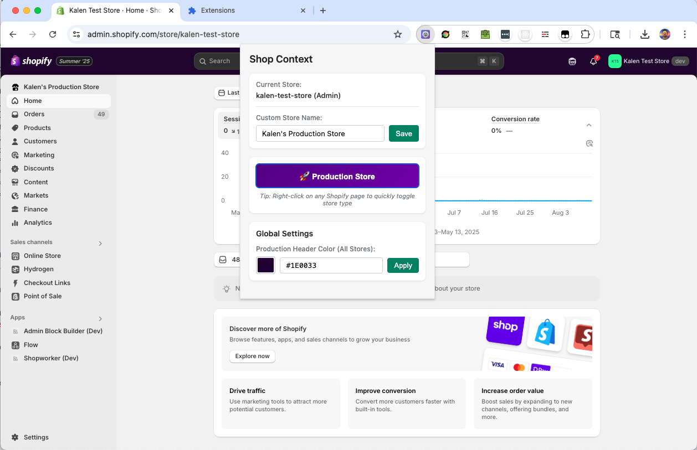

# ShopContext - Shopify Store Environment Indicator

A Chrome extension that helps you instantly identify whether you're working on a development or production Shopify store, with visual indicators and custom store naming.

## Features

- 🎨 **Visual Store Type Indicators**: Colored header overlay for production stores (customizable color)
- 🏷️ **Custom Store Names**: Add friendly names to your stores that appear in the Shopify admin navigation
- 🔄 **Quick Toggle**: Easily switch store type classification between development and production
- 🖱️ **Right-Click Context Menu**: Toggle store type directly from any Shopify page
- 💾 **Persistent Settings**: All settings are saved and remembered across browser sessions



## Installation

Since this extension is not yet available on the Chrome Web Store, you'll need to install it manually:

1. **Download or Clone the Repository**
   ```bash
   git clone https://github.com/kalenjordan/shopcontext.git
   ```
   Or download the ZIP file from GitHub and extract it.

2. **Open Chrome Extension Management**
   - Open Chrome browser
   - Navigate to `chrome://extensions/`
   - Or click the three dots menu → More Tools → Extensions

3. **Enable Developer Mode**
   - Toggle the "Developer mode" switch in the top right corner of the extensions page

4. **Load the Extension**
   - Click the "Load unpacked" button
   - Navigate to the folder where you downloaded/cloned ShopContext
   - Select the folder and click "Select"

5. **Pin the Extension** (Optional but recommended)
   - Click the puzzle piece icon in Chrome's toolbar
   - Find "ShopContext" in the list
   - Click the pin icon to keep it visible in your toolbar

## Usage

### Setting Store Type

1. Click the ShopContext icon in your Chrome toolbar while on a Shopify store
2. The toggle button shows the current store type (Development or Production)
3. Click the button to toggle between Development and Production
4. Production stores will show a colored header overlay (default: purple)

### Custom Store Names

1. Open the extension popup on any Shopify store
2. Enter a custom name in the "Custom Store Name" field (e.g., "Main Production Store")
3. Press Enter or click "Save"
4. The custom name will appear in the Shopify admin left navigation
5. Click on the custom name in the navigation to open the extension settings

### Customizing Production Color

1. Open the extension popup
2. In the Global Settings section, choose your preferred production header color
3. Use the color picker or enter a hex code
4. Press Enter or click "Apply"
5. All production stores will use this color for their header overlay

### Right-Click Quick Toggle

- Right-click anywhere on a Shopify admin page
- Select "Toggle Store Type (Dev/Prod)" from the context menu
- The store type will switch immediately

## How It Works

The extension automatically detects when you're on a Shopify store by looking for:
- URLs containing `myshopify.com`, `myshopify.io`, or `shopify.com`
- Shopify-specific page elements and scripts

For `admin.shopify.com` URLs, it extracts the store handle from the URL path to properly identify each store.

## Supported Shopify Environments

- Shopify Admin (`admin.shopify.com/store/...`)
- Development stores (`*.myshopify.io`)
- Production stores (`*.myshopify.com`)
- Custom domains (with Shopify backend)

## Privacy & Permissions

This extension:
- Only activates on Shopify-related domains
- Stores all data locally in your browser
- Does not send any data to external servers
- Does not track your browsing activity

Required permissions:
- `activeTab`: To detect and modify Shopify admin pages
- `storage`: To save your preferences
- `contextMenus`: For right-click functionality

## Troubleshooting

### Extension Not Working

1. Make sure you're on a Shopify store URL
2. Try refreshing the page
3. Check that the extension is enabled in Chrome

### Custom Name Not Appearing

- The custom name appears in the left navigation after the page fully loads
- It waits for the navigation to be ready (when "Sales channels" button appears)
- Try refreshing if it doesn't appear immediately

### Production Color Not Applying

- The color overlay applies to the top header bar
- Some Shopify themes might override the styling
- Try refreshing the page after changing the color

## Development

Built with:
- Vanilla JavaScript
- Chrome Extension Manifest V3
- No external dependencies

## Contributing

Feel free to submit issues and pull requests on GitHub!

## License

MIT License - See LICENSE file for details

## Author

Created by Kalen Jordan

---

**Note**: This is an unofficial extension and is not affiliated with or endorsed by Shopify Inc.